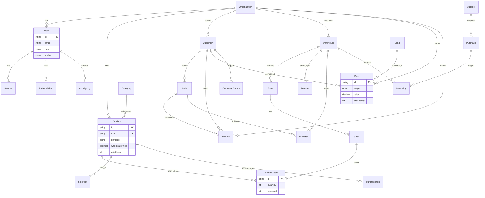

# Nexus Platform — Architecture & Documentation

> Enterprise-grade ERP + CRM + WMS for clothing wholesale companies.

---

## Quick Start

```bash
# Install dependencies
npm install

# Start PostgreSQL + Redis
docker compose up postgres redis -d

# Push schema & seed demo data
npm run db:push
npm run db:seed

# Start development server
npm run dev
```

**Demo login:** `admin@demo.com` / `Password123!`

---

## Folder Structure

```
nexus/
├── prisma/
│   ├── schema.prisma          # Full database schema (40+ models)
│   └── seed.ts                # Demo data seeder
├── src/
│   ├── app/
│   │   ├── (auth)/            # Login, Register
│   │   ├── (dashboard)/       # Protected app routes
│   │   │   └── dashboard/
│   │   │       ├── erp/       # Products, Invoices, Finance...
│   │   │       ├── crm/       # Customers, Leads, Deals...
│   │   │       └── wms/       # Warehouses, Inventory...
│   │   └── api/
│   │       ├── auth/          # Login, Logout
│   │       ├── health/        # Health check
│   │       └── v1/            # REST API endpoints
│   ├── components/
│   │   ├── ui/                # shadcn/ui primitives
│   │   ├── layout/            # Sidebar, Header, Command Palette
│   │   ├── dashboard/         # KPI cards, Charts, Timeline
│   │   ├── erp/               # Product grid, Invoice views
│   │   └── crm/               # Pipeline kanban
│   ├── features/              # Feature modules (modular monolith)
│   │   ├── auth/
│   │   │   ├── services/      # AuthService
│   │   │   └── actions/       # Server Actions
│   │   ├── erp/
│   │   │   └── repositories/  # ProductRepository, DashboardRepository
│   │   ├── crm/
│   │   │   └── repositories/  # CustomerRepository, DealRepository
│   │   ├── wms/
│   │   │   └── repositories/  # InventoryRepository
│   │   └── audit/
│   │       └── services/      # AuditService
│   ├── lib/
│   │   ├── auth/              # JWT, RBAC permissions
│   │   ├── cache/             # Redis cache layer
│   │   ├── db/                # Prisma client
│   │   ├── errors/            # AppError hierarchy
│   │   ├── pdf/               # Invoice PDF generation
│   │   ├── barcode/           # Barcode generation
│   │   ├── queue/             # BullMQ queues
│   │   ├── redis/             # Redis client
│   │   └── validations/       # Zod schemas
│   └── workers/               # Background job processors
├── nginx/                     # Reverse proxy config
├── docker-compose.yml         # Full stack orchestration
├── Dockerfile                 # Production app image
└── .github/workflows/         # CI/CD pipeline
```

---

## Database ERD



---

## Why Modular Monolith?

| Factor | Benefit |
|--------|---------|
| **Team velocity** | Single deploy, shared types, no network overhead between modules |
| **Consistency** | One database, one auth system, unified audit trail |
| **Simplicity** | No service mesh, no distributed tracing complexity at start |
| **Extract later** | Each `features/` module maps 1:1 to a future microservice |
| **Cost** | One VPS runs everything; no Kubernetes needed until scale demands it |

Modules communicate via **service layer interfaces**, not direct imports across boundaries. When WMS needs product data, it goes through `ProductRepository` — swap the implementation for an HTTP client later without changing callers.

---

## Why PostgreSQL?

- **ACID transactions** — critical for inventory, invoicing, and financial data
- **JSON columns** — flexible metadata without schema migrations
- **Full-text search** — built-in `tsvector` for global search at scale
- **Row-level security** — multi-tenant isolation at the database level
- **Mature ecosystem** — Prisma, pgBouncer, read replicas, partitioning
- **Complex queries** — revenue analytics, inventory heatmaps via raw SQL

---

## Why Next.js Fullstack?

- **Single codebase** — UI + API + background jobs share types
- **Server Actions** — mutations without REST boilerplate
- **Route Handlers** — REST API for mobile/integrations
- **Edge middleware** — JWT validation before page render
- **Streaming SSR** — fast dashboard loads with React Server Components
- **Deployment** — Vercel, Docker, or any Node.js host

---

## Scaling Strategy (Without Rewriting)

### Phase 1: Single VPS (0–10K users)
- Docker Compose: app + postgres + redis + nginx
- Redis cache for dashboard stats (5min TTL)
- Connection pooling via Prisma

### Phase 2: Optimized (10K–100K users)
- Read replicas for analytics queries
- BullMQ workers on separate container
- CDN for static assets and product images
- Database indexes on hot query paths (already in schema)

### Phase 3: Distributed (100K+ users)
- Extract WMS worker to dedicated service
- PostgreSQL partitioning by `organizationId`
- Redis Cluster for cache + queues
- Object storage (S3) for file uploads and PDFs
- Extract search to Elasticsearch/Meilisearch

Each phase requires **zero rewrites** — only infrastructure changes and extracting modules that are already isolated in `features/`.

---

## Security Recommendations

1. **JWT secrets** — 256-bit minimum, rotate quarterly
2. **Password hashing** — bcrypt with 12 rounds (implemented)
3. **RBAC** — 7 roles with granular permissions (implemented)
4. **Rate limiting** — nginx zones for auth (5r/s) and API (30r/s)
5. **Input validation** — Zod on all server actions and API routes
6. **SQL injection** — Prisma parameterized queries only
7. **CSRF** — SameSite cookies + Server Actions built-in protection
8. **Audit logging** — all mutations logged with user + IP
9. **HTTPS** — enforce via nginx + Let's Encrypt in production
10. **Secrets** — never commit `.env`; use Docker secrets or Vault

---

## VPS Deployment Guide

```bash
# 1. Provision VPS (Ubuntu 22.04+, 4GB RAM minimum)
ssh root@your-vps-ip

# 2. Install Docker
curl -fsSL https://get.docker.com | sh

# 3. Clone and configure
git clone https://github.com/your-org/nexus.git
cd nexus
cp .env.example .env
# Edit .env with production values

# 4. Build and start
docker compose up -d --build

# 5. Run migrations
docker compose exec app npx prisma db push
docker compose exec app npm run db:seed

# 6. SSL with Certbot
apt install certbot python3-certbot-nginx
certbot --nginx -d yourdomain.com

# 7. Verify
curl https://yourdomain.com/api/health
```

---

## Development Roadmap

### Sprint 1–2: Foundation ✅
- [x] Project scaffolding, Prisma schema, auth system
- [x] RBAC permissions, audit logging
- [x] Dashboard layout, sidebar, command palette
- [x] Docker Compose, CI/CD pipeline

### Sprint 3–4: ERP Core
- [ ] Product CRUD with image upload
- [ ] Purchase order workflow
- [ ] Sales order + invoice generation
- [ ] Expense tracking, finance dashboard
- [ ] PDF invoice export

### Sprint 5–6: CRM
- [ ] Customer 360 view with activity timeline
- [ ] Lead scoring and conversion
- [ ] Drag-and-drop deal pipeline
- [ ] Follow-up reminders (BullMQ scheduled jobs)
- [ ] Communication history

### Sprint 7–8: WMS
- [ ] Warehouse zone/shelf management
- [ ] Barcode scanning integration
- [ ] Stock transfer workflow
- [ ] Dispatch picking/packing
- [ ] Receiving against purchase orders
- [ ] Low stock alert automation

### Sprint 9–10: Polish
- [ ] Global search with Meilisearch
- [ ] Real-time notifications (WebSocket/SSE)
- [ ] Report builder with export
- [ ] Mobile-responsive warehouse UI
- [ ] Multi-warehouse analytics

---

## Clean Code Conventions

```
features/{module}/
  repositories/   → Data access (Prisma queries)
  services/       → Business logic
  actions/        → Server Actions (thin wrappers)
  schemas/        → Zod validation
  types/          → Module-specific types
```

- **Repositories** never import from other feature modules
- **Services** orchestrate repositories and emit audit logs
- **Actions** validate input, call services, handle errors
- **Components** are presentational; data fetching in page.tsx (RSC)
- **All mutations** go through Server Actions or API routes
- **Cache invalidation** happens in repositories after writes

---

## UX Flow

```
Login → Dashboard (KPI overview)
  ├── ⌘K Command Palette → Global search
  ├── ERP → Products (grid) → Product detail → Edit
  │   ├── Purchases → Create PO → Receive goods
  │   ├── Sales → Create order → Generate invoice → PDF
  │   └── Finance → Revenue charts, expense tracking
  ├── CRM → Customers (table) → Customer 360
  │   ├── Leads → Qualify → Convert to deal
  │   └── Deals → Kanban pipeline → Drag stages
  └── WMS → Warehouses → Inventory heatmap
      ├── Transfers → Inter-warehouse moves
      ├── Dispatch → Pick → Pack → Ship
      └── Receiving → Scan barcodes → Update stock
```

---

## Dashboard Screenshots (Description)

### Main Dashboard
- 7 KPI cards with trend indicators (revenue, products, customers, deals, orders, low stock, dispatches)
- Revenue area chart with indigo gradient fill (6-month trend)
- Deal pipeline horizontal bar chart
- Inventory heatmap grid (color-coded: green=normal, amber=low, red=empty)
- Activity timeline with user avatars

### Products Grid
- 4-column responsive card grid with product images
- Status badges (Active, Low Stock, Out of Stock)
- Wholesale price, stock count, SKU barcode
- Category filter pills, search, export actions

### CRM Pipeline
- 4-column kanban board (Prospect → Qualification → Proposal → Negotiation)
- Deal cards with value, probability bar, customer name
- Drag-and-drop stage transitions (Framer Motion animations)

### Invoice Page
- Summary cards (Outstanding, Paid, Overdue, Draft)
- Invoice list with status badges, send/print actions
- Professional PDF generation with company branding

### Warehouse Dashboard
- Warehouse cards with capacity utilization bars
- Total SKUs, units, inventory value KPIs
- Full inventory heatmap across all locations

---

## API Architecture

```
/api/auth/login      POST    Authenticate
/api/auth/logout     POST    Clear session
/api/health          GET     Health check
/api/v1/dashboard    GET     Stats, revenue, pipeline, activity
/api/v1/products     GET/POST  Product CRUD
/api/v1/search       GET     Global search
```

All `/api/v1/*` routes require JWT authentication via middleware.
RBAC permissions checked per-endpoint.

---

## Caching Strategy

| Key Pattern | TTL | Invalidation |
|-------------|-----|-------------|
| `dashboard:{orgId}` | 2 min | On sale/invoice create |
| `products:{orgId}:{page}` | 5 min | On product CRUD |
| `inventory:{orgId}` | 2 min | On stock movement |
| `pipeline:{orgId}` | 3 min | On deal stage change |
| `search:{orgId}:{query}` | 1 min | Time-based expiry |

Cache-aside pattern via `CacheService.getOrSet()`. Redis failures degrade gracefully — app continues without cache.

---

## Monitoring Setup

- **Health endpoint:** `GET /api/health` — database connectivity
- **Structured logging:** JSON logs with request ID, user ID, duration
- **Error tracking:** Sentry integration point in `handleError()`
- **Queue monitoring:** BullMQ dashboard (optional, add `@bull-board/express`)
- **Uptime:** External ping to `/api/health` (UptimeRobot, Betterstack)

---

## License

Proprietary — All rights reserved.
